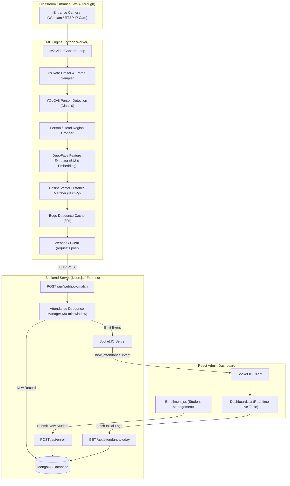

# Multimodal Automatic Attendance System - Architecture & Design

## 1. Executive Summary
This project implements an automated, walk-through attendance tracking system for educational classrooms. Instead of requiring manual roll calls or interactive kiosks that interrupt student flow, an entrance-mounted camera monitors the doorway. The system leverages:
1. **Computer Vision & Deep Learning (Python)**: YOLOv8 for person bounding box localization and DeepFace (FaceNet512 / VGG-Face) for facial embedding extraction and verification.
2. **Real-time Event Engine (Node.js & Socket.IO)**: High-throughput ingestion webhook with debouncing and instant WebSocket broadcasts.
3. **Admin Monitoring Dashboard (React & Tailwind CSS)**: Real-time visual dashboard showcasing arrival logs, live match types (Face, Body, Multimodal), and verification confidence.

---

## 2. System Architecture Diagram

---

## 3. High-Accuracy Strategy for 65 Students

1. **Entrance "Walk-Through" Mounting Angle**:
   - The camera is mounted above the classroom door frame (height: 2.1m - 2.4m) angled downward at ~15°–20° toward incoming students.
   - As students enter in natural single/double file, their faces occupy 200×200+ pixels.
2. **Multi-Vector Enrollment**:
   - Each student stores up to 3–5 embeddings (frontal, slightly angled left, slightly angled right) in the `Student` schema.
   - Distance computation computes $\min(\text{distance}(E_{\text{query}}, E_{\text{enrolled\_i}}))$.
3. **Session Cooldown / Debouncing**:
   - Both in-memory and database level debouncing prevent a student standing in the doorway from being logged dozens of times. A standard 30-minute cooldown window ensures clean single records per lecture.
4. **Multimodal Confidence Score**:
   - **Face Match**: Cosine similarity $\ge 0.70$.
   - **Multimodal (Face + Body context)**: Face similarity $\ge 0.65$ combined with persistent bounding box tracking.
   - **Body/Occluded Fallback**: Triggers an administrative attention flag on the live dashboard.
